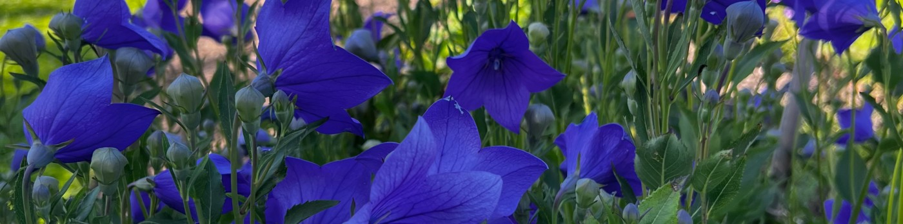

# Hi, I'm Ka 👋

Master's student in Informatics: Robotics and Intelligent Systems at the University of Oslo, researching the intersection of **large language models**, **evolutionary algorithms**, and **artificial life** for robotic optimization.

From September 2026 I'll be at **Nagoya University** as a visiting researcher, continuing this work under a new supervisor.

Side projects are deployed and displayed at [kathas.no/projects](https://kathas.no/projects)

- 🔬 Thesis: LLMs + Evolutionary Algorithms for robotic optimization using Lenia
- 🎓 TA for Introduction to Machine Learning @ UiO
- 🗺️ Oslo (Nagoya Sep–May)
- 🌍 Norwegian · English · Tamil · Spanish · learning Korean & Japanese
- ✉️ ka@kathas.no

## Languages

## Tools & Frameworks

